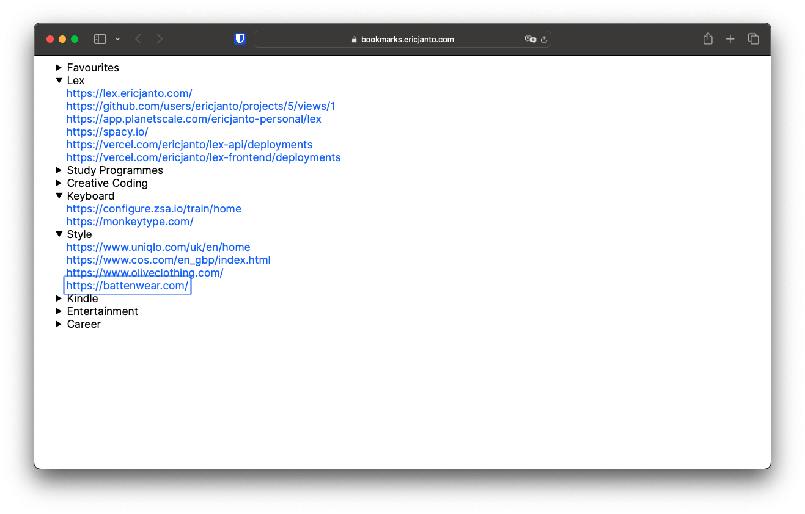

# Bookmarks
This was a 15min project to solve my frustration with modern browser's start
pages. I wanted a simple, fast, and keyboard-friendly way to access my
bookmarks.

The website is a single HTML file. Bookmarks are kept in a jsonl file (can be
kept as csv file as well). Everything can easily be hosted locally. No
external dependencies.